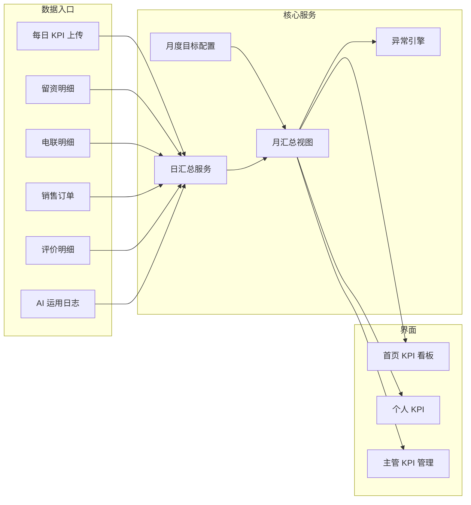

# 售前客服 KPI 管理板块 — 产品设计方案 & PRD

**文档角色**：资深客服管理系统产品经理 + 数据看板设计师  
**业务**：电商售前客服（商用包装机械：真空机、封口机、封箱机、打包机等）  
**版本**：v1.0 设计稿（可与现有「KPI绩效」DynamicTable、`KpiRecord` 模型迭代对齐）

---

## 一、KPI 模块整体架构

### 1.1 目标闭环

```
月度目标（主管配置） → 每日事实数据（客服/系统录入） → 日汇总 → 月滚动汇总
        ↓                                                      ↓
   权限与版本留痕                                      进度条 / 排名 / 异常引擎
```

### 1.2 逻辑分层

| 层级 | 职责 | 说明 |
|------|------|------|
| **数据采集层** | 每日上传、业务系统同步 | 留资、电联、订单、评价、AI 次数等；支持手工补录与导入 |
| **明细事实层** | 留资/电联/订单/评价明细表 | 可追溯、可审计；KPI 汇总由此计算，避免「只报总数」无法核对 |
| **目标与配置层** | 月度 KPI 目标、权重、封顶规则 | 按人、按月、按指标维度存储 |
| **汇总计算层** | 日汇总表、月汇总视图 | 定时任务 + 上传触发重算；完成率封顶 120% |
| **展示层** | 个人看板、主管看板、首页卡片 | 进度条、排名、钻取明细 |
| **异常与消息层** | 规则引擎 + 站内信/飞书 | 未上传、落后、不足类告警 |

### 1.3 模块关系（示意）



### 1.4 与现有系统的关系（建议）

- 现有 **询单转化、电联管理、评价管理、每日销售额、AI 运用反馈** 可作为数据源或双写；KPI 模块以 **「汇总表 + 目标表」** 为考核真相源。
- 现有 Prisma `KpiRecord` 偏简化，建议演进为 **多指标目标 + 日上传快照** 或新建 `KpiMonthlyTarget`、`KpiDailySubmission`、`KpiDailyAggregate`（见第十二节）。

---

## 二、左侧导航栏设计

### 2.1 原则

- **KPI 作为一级能力域**，其下二级菜单承载「配置 / 执行 / 分析」，避免单页堆砌。
- 权限：**客服**可见个人与上传；**主管/管理员**额外可见目标配置、全员排名、异常中心。

### 2.2 推荐导航结构

| 层级 | 菜单名称 | 路由（建议） | 角色 |
|------|----------|----------------|------|
| 一级 | **KPI 中心** | `/dashboard/kpi` | 默认落地为「我的 KPI」或概览 |
| 二级 | KPI 总览（首页子区跳转） | `/dashboard/kpi` 顶部 Tab | 全员 |
| 二级 | **我的 KPI** | `/dashboard/kpi/me` | 客服 |
| 二级 | **今日数据上传** | `/dashboard/kpi/daily-submit` | 客服 |
| 二级 | **月度目标** | `/dashboard/kpi/targets` | 主管 |
| 二级 | **团队排名与进度** | `/dashboard/kpi/team` | 主管 |
| 二级 | **异常与督办** | `/dashboard/kpi/alerts` | 主管 |
| 二级 | **指标说明与公式** | `/dashboard/kpi/docs` | 全员只读 |

> 若导航栏宽度有限：**KPI 中心** 点击展开子菜单；或保留一级「KPI绩效」链接到 `/dashboard/kpi`，页内左侧 **垂直 Tab** 实现上述子页面（见第十八节子页面优化）。

---

## 三、首页 KPI 看板布局

### 3.1 区块目标

在 **工作台首页** 用一屏内可扫视的信息，回答三件事：**本月整体健康度、谁要关注、我今天要做什么**。

### 3.2 布局（自上而下）

1. **标题行**：「本月 KPI 概览」+ 月份切换（默认当月）  
2. **第一行 — 五大核心指标卡片（团队聚合）**  
   - 每卡：指标名、团队平均完成率（加权或简单平均，需产品定稿）、环比箭头（可选）  
   - 点击钻取到主管「团队排名」并带上指标筛选  
3. **第二行 — 双栏**  
   - **左（60%）**：「异常需处理」列表（Top 5~10）：客服名、异常类型、严重度、发生日期、「去处理」  
   - **右（40%）**：「今日未上传数据」客服名单 + 一键提醒（主管）  
4. **第三行 — 个人区（登录为客服时显示）**  
   - 本人本月综合得分、综合完成率、五条迷你进度条（与第四节一致）  
   - CTA：**去上传今日数据**  

### 3.3 视觉密度

- 卡片圆角、浅底边框与现有 Panxo 风格一致（`DESIGN.md` Token）。  
- 数字用 `tabular-nums`；完成率主色遵循第十六节。

---

## 四、客服个人 KPI 页面设计

### 4.1 页面目标

让客服 **30 秒内** 看懂：本月每项完成多少、差多少、颜色预警、下一步动作。

### 4.2 布局结构

| 区域 | 内容 |
|------|------|
| **页头** | 月份选择、数据截至日期说明（如：统计至昨日 24:00） |
| **综合区** | 综合得分（大字）+ 综合完成率 + 一句话评语（由得分区间生成） |
| **指标卡片区（5 张）** | 每张：指标名、目标、实际（MTD）、完成率%、封顶后完成率%、单项得分、状态色带 |
| **进度条组** | 每项横向进度条，**封顶显示在 120%**（条满格在 120%，避免误解为可无限超） |
| **日历热力或折线（可选 v1.1）** | 每日完成率趋势，点击某天打开「当日上传明细」只读 |
| **底部操作** | 主按钮 **今日数据上传**；次按钮 **查看留资/电联/评价明细**（跳转对应子页或抽屉） |

### 4.3 交互

- 完成率 **<80%** 卡片左侧竖条红色；**80%~99%** 黄色；**≥100%** 绿色（与第十六节一致）。  
- 单项已超 120%：条满 + 标签「已达封顶 120%」。

---

## 五、主管 KPI 管理页面设计

### 5.1 信息架构（建议 Tab）

1. **月度目标配置**：表格编辑每人五项指标目标值、权重（若启用综合得分权重）。  
2. **团队排名**：表格 + 柱状图；列：排名、客服、综合得分、五项完成率、预警数。支持按指标排序。  
3. **完成进度大屏（可选）**：投影模式，轮播 Top/Bottom 与异常。  
4. **异常与督办**：筛选异常类型、日期、处理状态；支持导出、标记已处理、备注。  
5. **数据质量**：未上传日报列表、连续缺报天数。

### 5.2 关键操作

- **批量导入目标**（CSV/Excel）。  
- **一键重算**某月汇总（修复规则后使用）。  
- **下发通知**：站内消息或飞书 webhook（与第十七节联动）。

---

## 六、每日数据上传表字段

> 表名建议：`kpi_daily_submission` 或「每日 KPI 上传」

| 字段名 | 类型 | 必填 | 说明 |
|--------|------|------|------|
| id | UUID/自增 | 系统 | 主键 |
| business_date | DATE | 是 | 业务日（与统计日一致） |
| staff_user_id | FK | 是 | 客服用户 ID |
| staff_name_snapshot | 文本 | 否 | 冗余展示名，防改名追溯 |
| ai_usage_count | 整数 | 是 | 当日 AI 智能体运用次数（或有效会话数，需口径定义） |
| quality_leads_count | 整数 | 是 | 当日高质量留资条数（与明细可对账） |
| call_followup_count | 整数 | 是 | 当日电联追单完成次数（有效口径） |
| sales_amount | 金额 | 是 | 当日个人可归因销售额（与订单表汇总可对账） |
| review_guide_count | 整数 | 是 | 当日引导评价成功数 |
| note | 文本 | 否 | 备注 |
| attachment_urls | JSON/文本 | 否 | 截图或凭证 |
| submitted_at | 时间 | 系统 | 提交时间 |
| source | 枚举 | 系统 | web / import / api_sync |
| version | 整数 | 系统 | 乐观锁或修订次数 |

**约束**：`(business_date, staff_user_id)` 唯一；允许主管修正产生修订流水（审计表可选）。

---

## 七、月度目标设置表字段

> 表名建议：`kpi_monthly_target`

| 字段名 | 类型 | 必填 | 说明 |
|--------|------|------|------|
| id | 自增 | 系统 | 主键 |
| year_month | CHAR(7) | 是 | 如 `2026-05` |
| staff_user_id | FK | 是 | 客服 |
| target_ai_usage | 整数 | 是 | 月目标 AI 次数 |
| target_quality_leads | 整数 | 是 | 月目标高质量留资 |
| target_call_followup | 整数 | 是 | 月目标电联追单 |
| target_sales_amount | 金额 | 是 | 月目标销售额 |
| target_review_guide | 整数 | 是 | 月目标引导评价数 |
| weight_ai | 小数 | 否 | 权重，默认五项均等或产品配置 |
| weight_leads | 小数 | 否 | 同上 |
| weight_call | 小数 | 否 | 同上 |
| weight_sales | 小数 | 否 | 同上 |
| weight_review | 小数 | 否 | 同上 |
| cap_rate_per_metric | 小数 | 否 | 默认 1.2（120% 封顶） |
| created_by | FK | 是 | 主管用户 |
| created_at / updated_at | 时间 | 系统 | 审计 |

**约束**：`(year_month, staff_user_id)` 唯一。

---

## 八、客户留资明细表字段

> 支撑「高质量留资」KPI 对账与抽检

| 字段名 | 说明 |
|--------|------|
| id | 主键 |
| business_date | 留资业务日 |
| staff_user_id | 归属客服 |
| lead_id / buyer_id | 平台买家标识 |
| channel | 天猫/京东/拼多多等 |
| is_quality | 布尔 | 是否计为「高质量」（规则：必填字段齐、意向等级≥X 等，可配置） |
| quality_rule_version | 规则版本号 |
| phone_captured / wechat_captured | 是否拿到关键联系方式 |
| intent_level | 意向 |
| product_interest | 机型兴趣 |
| created_at | 创建时间 |

---

## 九、电联追单表字段

> 可与现有 `CallRecord` / 跟进模块对齐，以下为 KPI 视角必备字段

| 字段名 | 说明 |
|--------|------|
| id | 主键 |
| business_date | 业务日 |
| staff_user_id | 客服 |
| customer_ref | 客户/线索引用 |
| valid_for_kpi | 布尔 | 是否计入 KPI（时长、接通、有效沟通等规则） |
| attempt_no | 第几次电联 |
| duration_sec | 时长 |
| result_code | 接通/未接/意向提升等 |
| created_at | 记录时间 |

---

## 十、销售订单表字段

> KPI 用「可归因销售额」；可与 ERP/OMS 同步

| 字段名 | 说明 |
|--------|------|
| id | 主键 |
| order_no | 订单号 |
| business_date | 计绩日期（按发货/付款日政策定一版） |
| staff_user_id | 归因客服（首触/末触/按比例，需定规则） |
| amount | 订单金额 |
| product_category | 真空机/封口机等 |
| status | 已付款/已发货/退款 |
| refund_amount | 退款冲减 |

---

## 十一、客户评价表字段

> 与「评价管理」模块对齐

| 字段名 | 说明 |
|--------|------|
| id | 主键 |
| business_date | 业务日 |
| staff_user_id | 引导人 |
| platform_order_id | 订单/评价关联 |
| review_type | 好评/中评/差评 |
| is_guided | 是否计为「引导成功」 |
| screenshot_url | 凭证（可选） |
| created_at | 时间 |

---

## 十二、KPI 自动汇总表字段

> 表名建议：`kpi_daily_aggregate`（日）+ 物化视图或冗余 `kpi_monthly_aggregate`（月）

### 12.1 日汇总（每人每天一行）

| 字段名 | 说明 |
|--------|------|
| business_date | 业务日 |
| staff_user_id | 客服 |
| actual_ai / actual_leads / actual_calls / actual_sales / actual_reviews | 当日实际（来自上传+明细校验后的最终值） |
| mtd_ai … mtd_reviews | 截至当日月累计（可选冗余，或查询时算） |
| daily_score | 当日贡献得分（可选） |
| data_source | upload / system_merge |
| calculated_at | 计算时间 |

### 12.2 月汇总（每人每月一行，或视图）

| 字段名 | 说明 |
|--------|------|
| year_month | 月 |
| staff_user_id | 客服 |
| target_* / actual_* | 五项月目标与月累计实际 |
| rate_*_capped | 五项封顶完成率 |
| metric_score_* | 五项得分 |
| composite_score | 综合得分 |
| alert_count | 当月异常条数 |
| rank_in_team | 排名 |

---

## 十三、每个 KPI 的计算公式

**通用符号**：  
- \(T_i\)：月目标（第 i 项）  
- \(A_i\)：月累计实际（截至统计日）  
- \(\text{cap} = 120\%\)

**封顶完成率**：

\[
\text{rate\_capped}_i = \min\left(\frac{A_i}{T_i},\ \text{cap}\right)\quad (T_i>0)
\]

若 \(T_i=0\)：产品策略二选一：**不计入综合分** 或 **按特殊规则给满分/0 分**（需在目标配置禁止全 0）。

### 13.1 AI 智能体运用

- \(A_{\text{ai}}\)：月累计 AI 运用次数（来自每日上传与/或 AI 日志对齐后的较大值/可信值，需定稿）  
- \(\text{rate\_capped}_{\text{ai}} = \min(A_{\text{ai}}/T_{\text{ai}},\ 1.2)\)

### 13.2 高质量留资

- \(A_{\text{lead}}\)：月累计 **is_quality=true** 的留资条数（与明细汇总一致）  
- \(\text{rate\_capped}_{\text{lead}} = \min(A_{\text{lead}}/T_{\text{lead}},\ 1.2)\)

### 13.3 电联追单

- \(A_{\text{call}}\)：月累计 **valid_for_kpi=true** 的电联次数  
- \(\text{rate\_capped}_{\text{call}} = \min(A_{\text{call}}/T_{\text{call}},\ 1.2)\)

### 13.4 销售额完成度

- \(A_{\text{sales}}\)：月累计可归因销售额（扣退款后）  
- \(\text{rate\_capped}_{\text{sales}} = \min(A_{\text{sales}}/T_{\text{sales}},\ 1.2)\)

### 13.5 引导客户评价数量

- \(A_{\text{rev}}\)：月累计 `is_guided=true` 条数  
- \(\text{rate\_capped}_{\text{rev}} = \min(A_{\text{rev}}/T_{\text{rev}},\ 1.2)\)

### 13.6 单项得分（百分制，便于理解）

每项满分 100 分，则：

\[
\text{score}_i = 100 \times \frac{\text{rate\_capped}_i}{1.2}
\]

即：**封顶完成率 120% 时该项得 100 分**；60% 完成率约 50 分。  
（等价于 \(\text{score}_i = \min(\frac{A_i}{T_i}, 1.2) \times \frac{100}{1.2}\)。）

---

## 十四、KPI 综合得分公式

设权重 \(w_i\) 之和为 1（五项）：默认各 **0.2**。

\[
\text{composite\_score} = \sum_{i=1}^{5} w_i \cdot \text{score}_i
\]

**替代方案（更直观）**：综合完成率（不加权平均封顶率）：

\[
\text{composite\_rate} = \frac{1}{5}\sum_i \text{rate\_capped}_i
\]

再映射到百分制：\(\text{composite\_score} = 100 \times \frac{\text{composite\_rate}}{1.2}\)。

**产品建议**：对外展示「综合得分」用加权方案；对内分析可同时展示「均衡度」雷达图（五项 rate_capped）。

---

## 十五、异常提醒规则

| 规则 ID | 名称 | 条件 | 对象 | 级别 |
|---------|------|------|------|------|
| E1 | 未上传日报 | 业务日 D 已过截止时间，无 `kpi_daily_submission` | 客服本人 + 主管 | 高 |
| E2 | 销售额落后 | MTD 销售额 / 时间进度 < 目标进度的 80%（时间进度 = 已过工作日/月工作日） | 客服 + 主管 | 高 |
| E3 | 留资不足 | 高质量留资 MTD 完成率 <80% | 客服 + 主管 | 中 |
| E4 | 电联未完成 | 电联 MTD 完成率 <80% | 客服 + 主管 | 中 |
| E5 | 评价不足 | 引导评价 MTD 完成率 <80% | 客服 + 主管 | 中 |
| E6 | AI 使用不足 | AI 次数 MTD 完成率 <80% | 客服 + 主管 | 中 |
| E7 | 数据冲突 | 上传总数与明细汇总差异 > 阈值 | 主管 | 高 |
| E8 | 连续落后 | 连续 3 个工作日综合完成率 <80% | 主管 | 高 |

**触发时机**：每日定时（如 22:00）+ 每次上传/修正后异步重算。  
**状态**：open / acknowledged / resolved。

---

## 十六、颜色状态规则

| 条件 | 色板建议（与 DESIGN Token 对齐） | 用途 |
|------|-----------------------------------|------|
| 完成率 **< 80%** | 红系 `#b91c1c` / 浅底 `#fee2e2` | 预警条、标签、异常列表点 |
| **80% ≤ 完成率 < 100%** | 琥珀 `#b45309` / 浅底 `#fef3c7` | 提醒 |
| **完成率 ≥ 100%**（含封顶区展示） | 绿 `#047857` / 浅底 `#d1fae5` | 正常/优秀 |
| **无目标 / 未上传** | 石墨灰 `#5a5957` / 占位 `#f1f1f1` | 禁用进度或「—」 |

进度条：**0~120% 映射条长**，超过 100% 仍延伸直至 120% 满格，右侧文案显示真实完成率（如 135%）+ 文案「展示封顶 120%」。

---

## 十七、飞书多维表格实现方式

### 17.1 表结构映射

- **表 A**：月度目标（同第七节字段）  
- **表 B**：每日上传（同第六节）  
- **表 C~F**：留资、电联、订单、评价明细（第八~十一章）  
- **表 G**：日汇总（第十二章，可由自动化公式或单独「汇总表」）  
- **表 H**：异常记录（第十五节，状态列 + 负责人）

### 17.2 字段类型与公式列

- 完成率列（示例）：`IF(Target>0, MIN(Actual/Target, 1.2), BLANK())`  
- 得分列：`完成率封顶列 / 1.2 * 100`  
- 月累计：`SUMIF` 按客服+月 对表 B 求和（飞书多维表格支持跨表 lookup + 汇总字段）

### 17.3 自动化

- **定时提醒**：飞书自动化「每日 21:00」若当日无提交记录 @主管 @客服。  
- **视图**：  
  - 主管：「按完成率排序」「仅异常」  
  - 客服：「我的本月」筛选当前用户  
- **权限**：目标表仅主管可写；上传表客服可写本人行；明细表按角色行级权限（若支持）。

### 17.4 与网页系统关系

- **阶段 0**：飞书为数据源，网页只读展示（API 同步）。  
- **阶段 1**：网页为主库，飞书单向备份导出。  
- **阶段 2**：双向同步（成本高，谨慎）。

---

## 十八、React + Tailwind 网页系统 — 产品需求文档（含子页面优化）

### 18.1 产品目标（PRD 摘要）

| 项 | 描述 |
|----|------|
| **用户** | 售前客服、客服主管、系统管理员 |
| **场景** | 配目标、报数据、看进度、盯异常、钻明细 |
| **成功标准** | 日报上传率≥95%；主管每周打开异常中心≥3 次；争议可追溯到明细 |

### 18.2 路由与页面清单

| 路由 | 页面 | 核心组件 |
|------|------|----------|
| `/dashboard/kpi` | KPI 入口 / 总览 Tab | `KpiOverviewTabs` |
| `/dashboard/kpi/me` | 我的 KPI | `KpiPersonalDashboard` |
| `/dashboard/kpi/daily-submit` | 今日数据上传 | `KpiDailyForm` |
| `/dashboard/kpi/targets` | 月度目标（主管） | `KpiTargetGrid` |
| `/dashboard/kpi/team` | 团队排名 | `KpiLeaderboardTable` + 图 |
| `/dashboard/kpi/alerts` | 异常与督办 | `KpiAlertInbox` |
| `/dashboard/kpi/docs` | 指标与公式说明 | `KpiStaticDocs`（Markdown 渲染） |

### 18.3 子页面优化（信息架构与 UX）

1. **避免单页堆叠**：`/dashboard/kpi` 采用 **页内左侧垂直导航**（`w-48` 固定）+ 右侧内容区，与现有 `DashboardShell` 不冲突；移动端改为 **顶部 SegmentedControl**。  
2. **统一「业务月」上下文**：所有子页右上角 **月份选择器**（Context：`KpiMonthProvider`），切换月全局刷新。  
3. **今日上传** 与 **我的 KPI** 分离：上传页强调 **表单短、默认值、上次回填**；个人页强调 **只读进度 + 下钻**。  
4. **加载与骨架**：指标卡使用 `animate-pulse` 骨架，避免数字跳动闪烁（汇总接口返回 `asOf` 时间）。  
5. **权限空态**：主管页对客服返回 403 时展示插画 +「返回我的 KPI」而非白屏。  
6. **表格性能**：团队排名虚拟滚动（>50 人）；导出 CSV 走异步任务（可选）。  
7. **无障碍**：进度条增加 `aria-valuenow` / `aria-valuemax={120}`；色觉辅助下不仅依赖颜色（图标 ⚠️ ✓）。

### 18.4 关键接口（REST 草案）

- `GET /api/kpi/month-context?ym=2026-05` — 当前用户可见范围、截止日期  
- `GET /api/kpi/targets?ym=` — 主管拉全员目标  
- `PUT /api/kpi/targets` — 批量保存目标  
- `GET /api/kpi/my-progress?ym=` — 五项 + 综合 + 封顶  
- `POST /api/kpi/daily-submit` — 日报 upsert  
- `GET /api/kpi/team-ranking?ym=&sort=`  
- `GET /api/kpi/alerts?status=`  
- `POST /api/kpi/alerts/:id/ack`

### 18.5 组件与样式（Tailwind）

- **KpiMetricCard**：`rounded-card border border-ash bg-elevated shadow-subtle`；左侧色条 `w-1` 按第十六节变色。  
- **KpiProgressBar**：轨道 `h-2 rounded-full bg-ash`，填充 `from-mint-pulse to-emerald-tag`（≥100%）；`<80%` 用 `bg-red-600`。  
- **KpiAlertBadge**：`rounded-full px-2 py-0.5 text-xs font-semibold`。

### 18.6 与现有代码库衔接

- 将 `app/dashboard/kpi/page.tsx` 从单一 `DynamicTable` 升级为 **布局壳 + 子路由**（Next.js `app/dashboard/kpi/layout.tsx` + `me/page.tsx` 等），或 **单页多 Tab** 实现等价 IA。  
- `app/api/kpi/route.ts` 扩展为多指标 CRUD；首页 `warnings` 与 `dashboard/summary` 接入新汇总服务。

### 18.7 非功能需求

- **审计**：目标变更、日报修正留痕。  
- **口径版本**：高质量留资、有效电联规则变更带 `rule_version`。  
- **时区**：全站业务日按 `Asia/Shanghai`。

---

## 附录 A：名词与口径清单（需在评审会定稿）

| 名词 | 待定口径 |
|------|----------|
| AI 运用次数 | 会话数 / 点击次数 / 有效回复条数 |
| 高质量留资 | 必填字段 + 意向阈值 |
| 有效电联 | 接通秒数、是否本人、是否重复拨打 |
| 销售额归因 | 首触 / 末触 / 协作拆分 |
| 引导评价 | 是否必须五星、截图是否必须 |

---

**文档结束。** 实施时可按迭代：**M1 目标+日报+个人进度** → **M2 明细对账+主管排名** → **M3 异常引擎+通知**。
