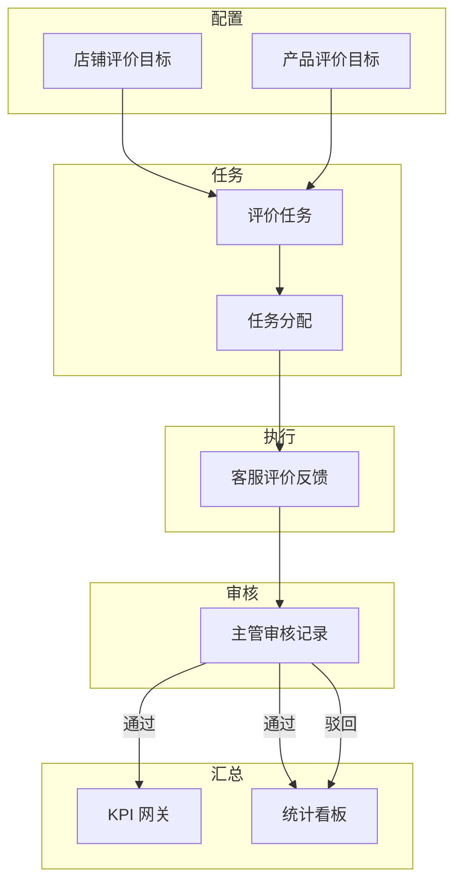

# 评价管理中心 — 完整产品设计方案

**定位**：电商售前客服团队对 **真实成交客户** 的评价引导与反馈管理（**禁止**虚假评价、刷评；系统合规声明与审计留痕为必备能力）。  
**行业**：商用包装机械（真空机、封口机、封箱机、打包机等），多店铺、多 SKU、多评价形态（文字/图/视频）。  
**版本**：v1.0 设计稿（可与现有 `评价管理` 页、`ReviewRecord` 模型迭代对齐）

---

## 一、评价管理中心整体架构

### 1.1 业务闭环

```
店铺/产品目标（主管） → 任务生成与分配 → 客服执行引导 → 客户真实评价 → 客服提交反馈（凭证）
        → 主管审核 → 通过则计入产品完成数 + 客服评价 KPI / 驳回则不计分 + 原因可追溯
```

### 1.2 逻辑分层

| 层级 | 职责 |
|------|------|
| **配置层** | 店铺维度目标、产品维度目标、周期类型（日/周/月/一次性）、新品基础评价条数、评价类型要求（文/图/视频） |
| **任务层** | 任务实例：关联店铺+产品+周期窗口+指派人+状态+截止时间 |
| **执行反馈层** | 客服提交：截图、订单号、客户 ID、评价链接等；状态：草稿/已提交/通过/驳回 |
| **审核层** | 主管审核、驳回原因、审核时间；与 KPI 网关联动（仅通过计入） |
| **汇总统计层** | 店铺/产品/客服完成度、新品基础进度、待审核数、逾期数 |
| **异常与消息层** | 规则引擎 + 站内信/飞书（可选） |

### 1.3 模块关系（示意）



### 1.4 合规与风控（原则）

- 产品文案与登录页声明：**仅管理真实成交客户的评价引导与反馈**；禁止刷单、虚假评价。  
- **审计**：反馈修改历史、审核人、IP/设备（可选）、重复提交检测。  
- **非目标产品 / 类型不符**：自动标异常，审核默认不通过或需二次确认（可配置）。

---

## 二、左侧导航栏设计

### 2.1 主导航（工作台侧栏）

建议将原「评价管理」升级为 **「评价管理中心」**。`/dashboard/reviews` **重定向至「我的任务」**。

### 2.2 评价模块内二级导航（当前精简实现）

| 菜单 | 路由 | 说明 |
|------|------|------|
| **我的任务** | `/dashboard/reviews/my-tasks` | 客服查看指派给自己的任务，并提交订单号/买家 ID 等反馈 |
| **店铺目标** | `/dashboard/reviews/shops` | 各店铺本月目标条数；**店铺列表与 `GET /api/options` 的 `shops` 同步** |
| **任务分配** | `/dashboard/reviews/assignments` | 创建任务并多选客服；店铺下拉同上 |
| **统计报表** | `/dashboard/reviews/analytics` | 按店铺目标 vs 提交数、按客服汇总 |

数据暂存浏览器 LocalStorage（`review-hub-v1`）。扩展规划仍见下文「任务总览」等章节，可按迭代恢复路由。

---

## 三、评价任务总览页面布局

### 3.1 首屏 KPI 卡片区（2×3 或响应式一行滑动）

1. **待审核数量**（主管视角高亮；客服隐藏或显示与自己相关）  
2. **逾期任务数**（全团队 / 本人筛选切换）  
3. **本周评价完成率**（加权或按任务数）  
4. **新品基础评价完成**（如：目标 10，已完成 6，剩余 4）  
5. **进度落后任务数**（低于时间进度阈值）  
6. **客服未反馈数**（已分配未完成未提交）

### 3.2 第二屏 — 双栏

- **左（约 65%）**：异常列表（见第十二节）Top N，支持「去处理」跳转任务详情。  
- **右（约 35%）**：店铺完成度迷你条形图 Top 5 + 「查看全部」进统计页。

### 3.3 第三屏 — 表格「近期任务快照」

列：任务名、店铺、产品、周期、截止日、负责人、完成/目标、状态色点。支持按店铺/产品/人筛选。

### 3.4 合规横幅

页面顶固定条：「本系统仅用于真实成交客户的评价引导记录与审核，严禁虚假评价。」

---

## 四、店铺评价目标表字段

> 表名建议：`review_shop_target`

| 字段名 | 类型 | 说明 |
|--------|------|------|
| id | PK | |
| shop_code | 文本 | 店铺唯一编码（天猫旗舰店等） |
| shop_name | 文本 | 展示名 |
| cycle_type | 枚举 | daily / weekly / monthly / once |
| cycle_anchor | 文本 | 周期锚点（如周起始日、月首） |
| target_count | 整数 | 周期内目标评价条数（审核通过计） |
| require_image_ratio | 小数 0~1 | 需带图评价比例下限（可选） |
| require_video_count | 整数 | 周期内需视频评价条数（可选） |
| effective_from / effective_to | 日期 | 目标生效区间 |
| status | 枚举 | draft / active / archived |
| created_by | FK | 主管 |
| created_at / updated_at | 时间 | |

---

## 五、产品评价目标表字段

> 表名建议：`review_product_target`

| 字段名 | 类型 | 说明 |
|--------|------|------|
| id | PK | |
| shop_code | 文本 | 归属店铺 |
| product_spu_id | 文本 | 产品/SPU 编码 |
| product_name | 文本 | 展示名 |
| is_new_product | 布尔 | 是否新品阶段 |
| base_review_target | 整数 | 新品基础评价数量（如 10） |
| ongoing_monthly_target | 整数 | 老品每月补充条数（可与周期目标合并） |
| cycle_type | 枚举 | daily / weekly / monthly / once |
| target_count | 整数 | 当前周期总目标（可与基础目标拆分两条记录，或一条内嵌） |
| review_type_required | 枚举 | text / image / video / mixed |
| min_image_count | 整数 | 周期内至少图评条数 |
| min_video_count | 整数 | 周期内至少视频评条数 |
| effective_from / effective_to | 日期 | |
| status | 枚举 | draft / active / archived |
| created_by | FK | |
| created_at / updated_at | 时间 | |

**说明**：新品「基础 10 条」可独立为 `phase=new_launch` + `target_count=10` + `cycle_type=once`，完成后切换 `phase=mature` 走持续补充规则。

---

## 六、评价任务表字段

> 表名建议：`review_task`（由目标实例化或手工创建）

| 字段名 | 类型 | 说明 |
|--------|------|------|
| id | PK | |
| shop_code | 文本 | |
| product_spu_id | 文本 | 可空表示店铺级总任务 |
| task_name | 文本 | 展示标题 |
| source | 枚举 | shop_target / product_target / manual |
| source_ref_id | FK | 指向店铺或产品目标 |
| cycle_type | 枚举 | 继承目标 |
| period_start / period_end | 日期 | 本任务统计窗口 |
| target_count | 整数 | 本窗口需完成条数 |
| completed_count | 整数 | **审核通过**累计（系统维护） |
| assignee_user_ids | JSON | 多客服 ID 列表 |
| primary_owner_id | FK | 主负责人（可选） |
| deadline | 日期时间 | 逾期判定 |
| priority | 整数 | 排序 |
| status | 枚举 | pending / in_progress / completed / overdue / cancelled |
| new_product_phase | 枚举 | none / new_launch / mature | 新品阶段标记 |
| created_at / updated_at | 时间 | |

---

## 七、客服评价反馈表字段

> 表名建议：`review_feedback`

| 字段名 | 类型 | 说明 |
|--------|------|------|
| id | PK | |
| task_id | FK | 关联任务 |
| staff_user_id | FK | 提交人 |
| order_no | 文本 | 订单号 |
| buyer_id | 文本 | 平台客户 ID |
| review_url | 文本 | 评价链接（可选） |
| review_type_submitted | 枚举 | text / image / video |
| screenshot_urls | JSON | 多张截图 |
| note | 文本 | 客服备注 |
| submitted_at | 时间 | |
| audit_status | 枚举 | pending / approved / rejected |
| audit_reason | 文本 | 驳回原因 |
| audited_by | FK | 主管 |
| audited_at | 时间 | |
| duplicate_flag | 布尔 | 系统标重复 |
| mismatch_product_flag | 布尔 | 非目标产品嫌疑 |
| kpi_credited | 布尔 | 是否已计入 KPI（防双计） |
| created_at / updated_at | 时间 | |

---

## 八、主管审核页面字段

审核页本质是 **反馈表 + 任务上下文 + 审核动作**，列表与详情均需：

| 区块 | 字段/元素 |
|------|-----------|
| **任务上下文** | 店铺、产品、周期、目标类型、要求（图/视频）、已完成/目标 |
| **反馈内容** | 订单号、客户 ID、评价类型、截图预览、链接、提交人、提交时间 |
| **校验提示** | 重复提交、非目标产品、类型不符、截图缺失（系统标签） |
| **审核操作** | 通过 / 驳回；驳回必选原因枚举 + 自由文本 |
| **审计** | 审核人、审核时间、历史记录 |

列表额外列：`反馈ID`、`任务`、`提交人`、`审核状态`、`标签（异常）`、`操作`。

---

## 九、客服端任务页面设计

### 9.1 「我的任务」列表

- 筛选：状态（待开始/进行中/已逾期）、店铺、截止时间排序。  
- 每行：任务名、产品、周期、**完成进度条**（已完成/目标）、截止日、**提交反馈**按钮。

### 9.2 提交反馈表单（抽屉或子页）

- 必填：订单号、客户 ID、评价类型、至少一张截图（若目标要求图评则校验）。  
- 选填：评价链接、备注。  
- 提交后状态 **待审核**；可编辑截止时间前允许撤回（可选）。

### 9.3 个人统计条

本月已审核通过条数、待审核条数、被驳回条数（带原因折叠列表）。

---

## 十、评价完成率计算公式

对某一 **任务** 在统计时点：

\[
\text{completion\_rate} = \frac{C_{\text{approved}}}{T} \times 100\%
\]

- \(C_{\text{approved}}\)：周期内 **审核通过** 的反馈条数（去重订单/评价按业务规则）  
- \(T\)：`target_count`（>0）

**店铺维度**：聚合该店铺下所有任务（或按配置仅计店铺级任务）：

\[
\text{shop\_rate} = \frac{\sum C_{\text{approved}}}{\sum T}
\]

**产品维度**：同上，筛选 `product_spu_id`。  
**新品基础**：单独指标：

\[
\text{new\_base\_rate} = \min\left(\frac{C_{\text{approved\_new\_phase}}}{B},\,1\right)\times 100\%
\]

\(B\) = `base_review_target`。

**时间进度校正（用于「进度落后」）**：

\[
\text{expected\_progress} = \frac{\text{已过天数（或工时）}}{\text{周期总天数}} \times T
\]

若 \(C_{\text{approved}} < 0.8 \times \text{expected\_progress}\) 则标「进度落后」（与第十二节一致）。

---

## 十一、客服评价KPI计分规则

> 与 KPI 中心联动：仅 **审核通过** 的反馈计入。

**方案 A（计件）**：每通过 1 条 = `k_point` 分，月度封顶 `k_cap`（避免无限刷）。  
**方案 B（完成率折线）**：个人本月负责任务的加权平均完成率 → 映射到 0–100 分：

\[
\text{score} = 100 \times \sum_j w_j \times \min\left(\frac{C_j}{T_j},\,1.2\right) / 1.2
\]

权重 \(w_j\) 可按任务目标量占比或均等。  
**方案 C（与 KPI PRD 对齐）**：评价作为 KPI 五项之一「引导客户评价数量」，则本中心审核通过时 **+1 实际值** 写入 KPI 汇总接口。

**驳回**：不计入 \(C_{\text{approved}}\)，可计「审核质量」负向分（可选，慎用）。

---

## 十二、异常提醒规则

| 规则 ID | 名称 | 条件 | 对象 |
|---------|------|------|------|
| R1 | 任务逾期 | `now > deadline` 且 `completed < target` | 负责人、主管 |
| R2 | 进度落后 | 见第十节时间进度校正 <80% | 负责人、主管 |
| R3 | 客服未反馈 | 已分配且周期过半仍无提交 | 负责人、主管 |
| R4 | 待审核过多 | `pending_count > 阈值`（全局或按人） | 主管 |
| R5 | 截图缺失 | 要求图评但 `screenshot_urls` 空 | 提交人（退回草稿）、主管 |
| R6 | 重复提交 | 同订单号+任务重复 | 主管标红、自动拦截二次提交（可配置） |
| R7 | 非目标产品 | 订单 SKU 与任务产品不一致 | 审核不通过建议 |
| R8 | 评价类型不符 | 要求 video 但提交 text | 审核不通过建议 |

**触发**：定时任务 + 提交/审核后即时刷新。

---

## 十三、颜色状态规则

| 状态 | 颜色建议 | 适用 |
|------|-----------|------|
| 待审核 | 琥珀 `#b45309` / 浅底 `#fef3c7` | 徽章、行左侧条 |
| 已通过 | 绿 `#047857` / `#d1fae5` | |
| 已驳回 | 红 `#b91c1c` / `#fee2e2` | |
| 进行中且健康 | 石墨 `#5a5957` | |
| 逾期 | 深红 `#991b1b` + 图标 ⚠️ | |
| 进度落后 | 黄 `#b45309` | |

**完成率条**：&lt;80% 红、80–99% 黄、100%+ 绿（与 KPI 文档一致，便于用户心智统一）。

---

## 十四、飞书多维表格实现方式

### 14.1 表拆分

- 表1：店铺目标（第四节字段）  
- 表2：产品目标（第五节）  
- 表3：任务（第六节）  
- 表4：反馈（第七节）  
- 表5：审核日志（可选，从反馈表状态变更派生）

### 14.2 关联与公式

- 任务表「已完成」：关联反馈表，`COUNTIF(审核状态=通过)`。  
- 完成率：公式列 `IF(Target>0, Approved/Target, 0)`。  
- 逾期：公式或自动化 `IF(AND(Today>Deadline, Approved<Target), "逾期", "")`。

### 14.3 自动化与视图

- 每日提醒：待审核 > N → @主管。  
- 截止前 48h：任务完成 <50% → @负责人。  
- 视图：「待我审核」「我的任务」「逾期」「按店铺」。

### 14.4 与网页系统

阶段 0：飞书为主；网页读 API。阶段 1：网页为主，飞书导出备份。

---

## 十五、React + Tailwind 产品需求文档（PRD）

### 15.1 目标用户与场景

| 角色 | 场景 |
|------|------|
| 客服 | 查看分配、提交凭证、查看驳回原因 |
| 主管 | 配置目标、分配、审核、看统计与异常 |
| 管理员 | 权限、店铺主数据、规则版本 |

### 15.2 路由结构（Next.js App Router）

```
app/dashboard/reviews/
  layout.tsx          # 评价中心壳 + 子导航
  page.tsx            # 任务总览
  my-tasks/page.tsx   # 我的任务
  pending-review/page.tsx  # 待审核（主管）
  shops/page.tsx      # 店铺目标
  products/page.tsx   # 产品目标
  assignments/page.tsx # 任务分配
  analytics/page.tsx  # 统计报表
  docs/page.tsx       # 指标说明与合规
```

### 15.3 页面级需求摘要

| 页面 | 核心需求 |
|------|-----------|
| 总览 | 第十二节指标卡 + 异常列表 + 合规横幅 |
| 我的任务 | 第九节；支持移动端卡片化 |
| 待审核 | 第八节；批量通过/驳回（二期） |
| 店铺/产品目标 | CRUD、周期类型、新品基础数 |
| 分配 | 多选客服、批量生成任务 |
| 统计 | 店铺/产品/客服/新品/待审/逾期多维下钻 |
| docs | 合规声明 + 字段说明 |

### 15.4 非功能需求

- **权限**：RBAC；客服仅本人任务与本人反馈。  
- **性能**：反馈列表分页；图片 CDN/对象存储。  
- **安全**：敏感字段脱敏展示；操作审计。  
- **国际化**：暂中文。

### 15.5 技术栈

- React 18 + Next.js + Tailwind（现有 `DESIGN.md` Token：`coal-ink`、`ash`、`emerald-tag` 等）。  
- 组件：`ReviewStatCard`、`ReviewProgressBar`、`ReviewFeedbackForm`、`ReviewAuditDrawer`。

### 15.6 验收标准（MVP）

1. 主管可创建店铺/产品目标并生成任务、分配客服。  
2. 客服可提交反馈并看到审核状态。  
3. 主管可审核；通过后任务完成数 +1 且触发 KPI 更新（接口级）。  
4. 总览展示待审数、逾期数、店铺/产品完成率聚合。  
5. 异常规则 R1–R8 至少实现 R1、R4、R5、R6 的检测与展示。

---

**文档结束。** 实施建议迭代：**MVP 任务+反馈+审核+总览** → **目标配置与分配** → **异常引擎与飞书同步**。
