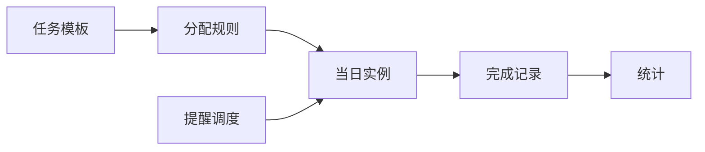

# 客服今日任务中心 — 产品设计与 MVP 说明

**业务**：电商售前（商用包装机械），每日接待、留资、电联、报价、AI 沉淀、评价引导、日报等。  
**MVP**：浏览器 LocalStorage（`today-tasks-v1`）+ 可选浏览器通知；后续接 Prisma/API。

---

## 一、今日任务中心整体架构

| 层级 | 职责 |
|------|------|
| **配置层** | 任务模板、分配规则（单次/每日/每周）、时间段与优先级 |
| **实例层** | 按「日期 + 客服」展开当日任务实例（虚拟生成 + 完成状态合并） |
| **执行层** | 时间轴展示、多种完成方式、打卡时间戳 |
| **提醒层** | 开始前 5 分钟提醒；逾期标记；P0 逾期主管提示 |
| **汇总层** | 主管看板：人数、完成率、逾期、P0 未闭环 |
| **联动层（占位）** | KPI / 评价 / 电联 — MVP 用字段与事件钩子预留 |

---

## 二、左侧导航栏设计

工作台侧栏保持 **「今日任务中心」→ `/dashboard/tasks`**。模块内使用 **顶部 Tab**（不分流路由，降低 MVP 复杂度）：

| Tab | 角色 | 说明 |
|-----|------|------|
| 我的今日 | 客服 | 时间轴 + 完成动作 |
| 任务模板 | 管理员 | CRUD 模板 |
| 分配任务 | 管理员 | 按人、时段、重复规则分配 |
| 主管看板 | 主管 | 全员当日进度与指标 |

*权限后续可通过角色裁剪 Tab。*

---

## 三、客服端今日任务页面设计

- **身份**：下拉选择当前客服（与 `/api/options` 的 `staff_roster` 同步，缺省本地记忆）。
- **布局**：左（或上）**日期**默认今日；主区 **纵向时间轴**：每条显示时段、标题、优先级标签、完成方式图标。
- **交互**：根据完成方式展示「打勾」「填数量」「上传截图说明」「关联客户」「日报链接」「评价截图」「电联数量」等控件。
- **延期**：未完成时可填「延期说明」写入完成记录。
- **通知**：首次进入请求浏览器通知权限；任务开始前 5 分钟推送（需页面打开且授权）。

---

## 四、主管端任务看板设计

- **日期**：选择业务日，默认今日。
- **统计卡片**：今日任务总数、已完成、未完成、逾期、P0 未完成、完成率。
- **明细表**：客服 × 任务列表折叠或按人分组；逾期标红，P0 加粗。
- **告警条**：存在 **P0 且逾期且未完成** 时顶部固定提示。

---

## 五、任务模板表字段设计（逻辑）

| 字段 | 类型 | 说明 |
|------|------|------|
| id | string | |
| name | string | 模板名称 |
| description | string? | |
| defaultPriority | P0–P3 | |
| completionMode | enum | 见第十三节 |
| linkModule | kpi / reviews / calls / none | 联动占位 |
| createdAt | ISO | |

---

## 六、每日任务（分配规则）表字段设计

| 字段 | 说明 |
|------|------|
| id | |
| templateId | 可选关联模板 |
| title | 任务标题 |
| staffNames | string[] | 指派客服姓名 |
| recurrence | once / daily / weekly |
| date | 单次任务的日期 |
| weekdays | 每周重复的星期（0–6） |
| startTime / endTime | HH:mm |
| priority | P0–P3 |
| completionMode | |
| quantityTarget | 数量类默认目标 |
| shiftLabel | 班次文案 |
| active | |
| kpiTag | 完成后是否提示计入 KPI |

---

## 七、任务完成反馈表字段设计（合并存储）

| 字段 | 说明 |
|------|------|
| instanceKey | assignmentId + staff + date |
| status | pending / done / overdue（展示态可计算） |
| completedAt | |
| quantityDone | |
| effectiveQty | 电联有效通次 |
| screenshotNote | 截图说明或外链 |
| customerRef | 关联客户 |
| deferNote | 延期说明 |
| dailyReportSummary | 日报摘要 |

---

## 八、任务统计表字段设计（虚拟聚合）

按日期 + 客服聚合：**assignedCount、doneCount、overdueCount、p0OpenCount、completionRate**。

---

## 九、任务状态自动判断逻辑

1. **未完成** 且 **当前时间 > 结束时间** → **逾期**（overdue）。  
2. **任一完成字段满足完成条件**（见第十三节）→ **done**，写 `completedAt`。  
3. 其余 → **pending**。  
4. 用户填写 **deferNote** 不改变 done，但在 UI 显示「已说明延期」标签。

---

## 十、优先级排序规则

排序键：**P0 < P1 < P2 < P3**（数值 0–3）；同级按 **开始时间** 升序。

---

## 十一、弹窗提醒规则

- **T_start - 5min**：浏览器 **Notification**（若权限 granted）+ 页面内 **toast/轻量弹层**（同一任务仅提醒一次，用 Set 记录已提醒 instanceKey）。

---

## 十二、逾期提醒规则

- **结束时刻后** 首次检测到未完成：浏览器通知「任务已逾期」+ 列表红色标记（同一任务每日最多提醒一次逾期）。  
- **P0 + 逾期 + 未完成**：写入主管看板 **告警列表**，主管 Tab 顶部横幅。

---

## 十三、任务完成方式设计

| completionMode | 完成条件 |
|----------------|----------|
| checkbox | 点击完成 |
| quantity | quantityDone ≥ quantityTarget（默认 1） |
| screenshot | screenshotNote 非空（MVP 填文字/链接） |
| customer | customerRef 非空 |
| daily_report | dailyReportSummary 非空 |
| review_upload | screenshotNote 非空（代表已上传待审核） |
| calls_metrics | quantityDone、effectiveQty 均填写 |

---

## 十四、和 KPI、电联、评价模块的联动方式

| 模块 | MVP 行为 |
|------|-----------|
| **KPI** | 分配项 `kpiTag=true` 且任务标记完成时，界面 Toast「请到 KPI 模块核对计入」；不接真实 KPI API。 |
| **评价** | `completionMode=review_upload` 完成时提示跳转 **评价管理中心**（外链 `/dashboard/reviews/my-tasks`）。 |
| **电联** | `calls_metrics` 收集数量字段；提示跳转 `/dashboard/calls` 核对（占位）。 |

---

## 十五、React + Tailwind 页面原型设计

- **壳**：`max-w-6xl` 内容区；Tab 使用 `rounded-full` 药丸按钮（与现有 Dashboard 一致）。  
- **优先级**：P0 红底、P1 琥珀、P2 蓝、P3 灰。  
- **时间轴**：左侧竖线 + 时间点 HH:mm–HH:mm。  
- **表格**：`border-ash`、`bg-elevated`，斑马纹可选。

---

## 十六、LocalStorage MVP 实现说明

- **Key**：`today-tasks-v1`  
- **结构**：`{ templates, assignments, completions }`  
- **入口**：`app/dashboard/tasks/page.tsx` → `TodayTasksApp`  
- **客服名单**：`GET /api/options` → `staff_roster`  
- **提醒**：`setTimeout` 调度 + `Notification` API  

详见代码：`lib/today-tasks/*`、`components/today-tasks/TodayTasksApp.tsx`。
